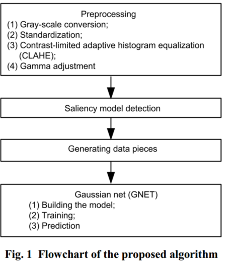
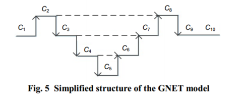

# A saliency and Gaussian net model for retinal vessel segmentation \*（6）

[融合显著性模型和高斯网模型...视网膜血管分割方法（英文）\_Lan-yan XUE.pdf](<file/融合显著性模型和高斯网模型...视网膜血管分割方法（英文）_Lan-yan XUE_dYTaySVj.pdf> "融合显著性模型和高斯网模型...视网膜血管分割方法（英文）_Lan-yan XUE.pdf")

💕论文说明

提出了一种新的深度学习结构高斯网络（GNET）模型，

为了获得具有完整分辨率的视网膜血管的清晰边缘，我们使用**显著性图像**作为深度学习网络的输入图像

我们未来的工作将集中在三个方面:

(1)考虑到图像超分辨率可以增加小图像的尺寸并防止图像质量的下降，因此需要加入深度卷积层(Hu et al, 2016);

(2)使用锚定邻域索引算法(Wang et al .， 2018)生成更多的补丁;

(3)将贝叶斯学习(Wang et al .， 2017)应用于深度学习，仅从少量训练样本中产生更准确的模型。这些进展将用于进一步提高视网膜血管分割的性能。

🙌算法流程图

😶‍🌫️GNET模型

文中提出的模型只有这一幅图：

GNET模型的左侧结构由池化层组成，导致分辨率较低。然而，尽管在后半部分结构中进行了上采样，但仍会丢失一些细节。提出了改进的GNET模型，以获得更精确的特征和细微的细节。在左边的结构中，第一层是上采样，其他层是最大池化。在正确的结构中，最后一层是最大池化，其他层是上采样。新模型也是对称的。简化后的结构如图5所示。这种新结构被称为GNET模型，因为它类似于**高斯分布曲线**的形状

向上箭头表示上采样;向下的箭头表示最大池化;带箭头的虚线表示合并。

改模型仅和U-Net进行比较
