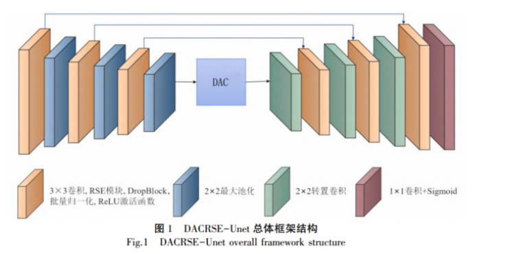
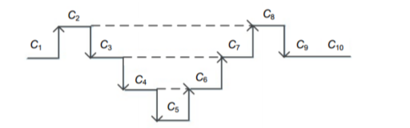
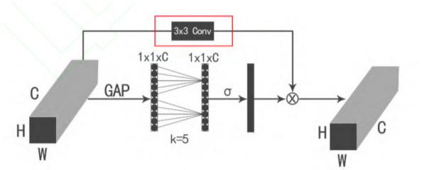

# DACRSE+ECA（\_X）+GNet







整合三者，将ECA\_X的3\*3卷积换成1\*3+3\*1

```纯文本
import torch
import torch.nn as nn
from RSE import Rse
from DAC import DAC_Block
import torch.nn.functional as F


class skip_():
    def __init__(self, in_channel, out_channel):
        self.skip = nn.Sequential(
            nn.Conv2d(in_channels=in_channel, out_channels=out_channel, kernel_size=(1, 3), stride=2, padding=(0, 1),
                      bias=False),
            nn.BatchNorm2d(out_channel),
            nn.ReLU(),
            nn.Conv2d(in_channels=out_channel, out_channels=out_channel, kernel_size=(3, 1), stride=2, padding=(1, 0),
                      bias=False),
            nn.BatchNorm2d(out_channel),
            nn.ReLU()
        )

    def forward(self, x):
        x = self.skip(x)
        return x


class expansive_block(nn.Module):
    def __init__(self, in_channels, out_channels):
        super(expansive_block, self).__init__()
        self.block = Rse(input_channels=in_channels, output_channels=out_channels)

    def forward(self, e, d):
        diffY = e.size()[2] - d.size()[2]
        diffX = e.size()[3] - d.size()[3]
        d = F.pad(d, [diffX // 2, diffX - diffX // 2, diffY // 2, diffY - diffY // 2])  # 对上采样后的张量进行填充
        cat = torch.cat([e, d], dim=1)
        out = self.block(cat)
        return out


class DACRse_Gnet(nn.Module):
    def __init__(self, in_channel):
        super(DACRse_Unet, self).__init__()
        self.up=nn.Sequential(
            nn.ConvTranspose2d(in_channels=3,out_channels=3,kernel_size=2,stride=2),
        )

        self.rse1 = Rse(input_channels=in_channel, output_channels=64)
        self.rse2 = Rse(input_channels=64, output_channels=128)
        self.rse3 = Rse(input_channels=128, output_channels=256)
        self.pool = nn.MaxPool2d(kernel_size=2)

        self.dac = DAC_Block(256, mid_channel=256, out_channel=512)

        self.Deconv_3 = nn.Sequential(
            nn.ConvTranspose2d(in_channels=512, out_channels=256, kernel_size=2, stride=2),
            nn.BatchNorm2d(256),
            nn.ReLU()
        )

        self.Deconv_2 = nn.Sequential(
            nn.ConvTranspose2d(in_channels=256, out_channels=128, kernel_size=2, stride=2),
            nn.BatchNorm2d(128),
            nn.ReLU()
        )
        self.Deconv_1 = nn.Sequential(
            nn.ConvTranspose2d(in_channels=128, out_channels=64, kernel_size=2, stride=2),
            nn.BatchNorm2d(64),
            nn.ReLU()
        )

        self.drse3 = expansive_block(in_channels=512, out_channels=256)
        self.drse2 = expansive_block(in_channels=256, out_channels=128)
        self.drse1 = expansive_block(in_channels=128, out_channels=64)

        self.skip3 = skip_(256, 256)
        self.skip2 = skip_(128, 128)
        self.skip1 = skip_(64, 64)

        self.down=nn.Sequential(
            nn.MaxPool2d(kernel_size=2),
        )

        self.Last = nn.Sequential(
            nn.Conv2d(in_channels=64, out_channels=3, kernel_size=1),
            nn.BatchNorm2d(3),
            nn.Sigmoid()
        )

    def forward(self, x):
        x=self.up(x)
        x1 = self.rse1(x)
        # print(x1.shape)
        x1_pool = self.pool(x1)
        x2 = self.rse2(x1_pool)
        # print(x2.shape)
        x2_pool = self.pool(x2)
        # print(x2_pool.shape)
        x3 = self.rse3(x2_pool)
        # print(x3.shape)
        x3_pool = self.pool(x3)
        # print(x3_pool.shape)
        DAC_ = self.dac(x3_pool)
        # print(DAC_.shape)
        L3 = self.skip3.forward(x3)
        L2 = self.skip2.forward(x2)
        L1 = self.skip1.forward(x1)

        dx3 = self.Deconv_3(DAC_)
        # print(dx3.shape)
        rx3 = self.drse3(dx3, L3)
        # print(rx3.shape)
        dx2 = self.Deconv_2(rx3)
        rx2 = self.drse2(dx2, L2)
        dx1 = self.Deconv_1(rx2)
        rx1 = self.drse1(dx1, L1)
        rx0=self.down(rx1)
        out = self.Last(rx0)
        return out


if __name__ == "__main__":
    img = torch.randn(1, 3, 256, 256)
    net = DACRse_Gnet(3)
    img = net(img)
    print(img.shape)

```
