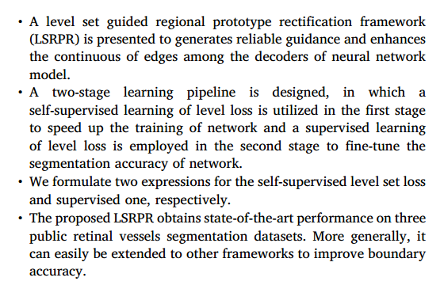
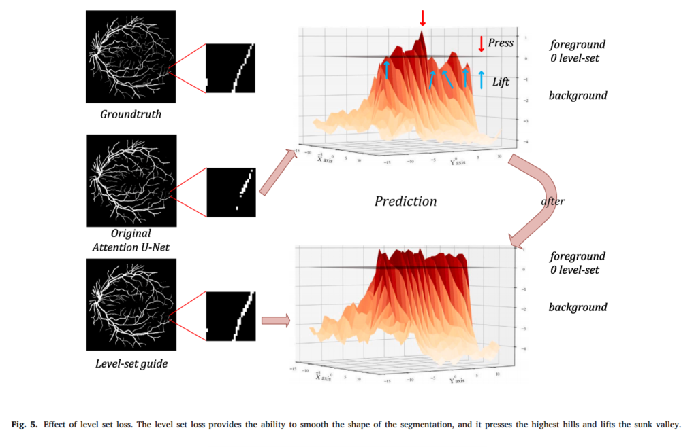
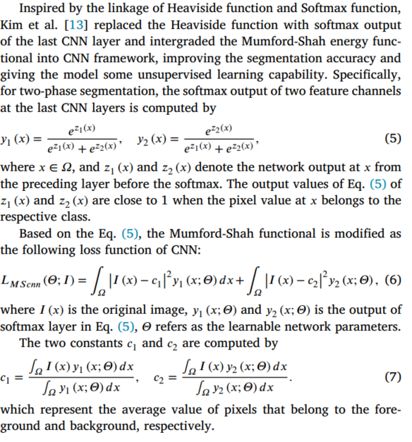
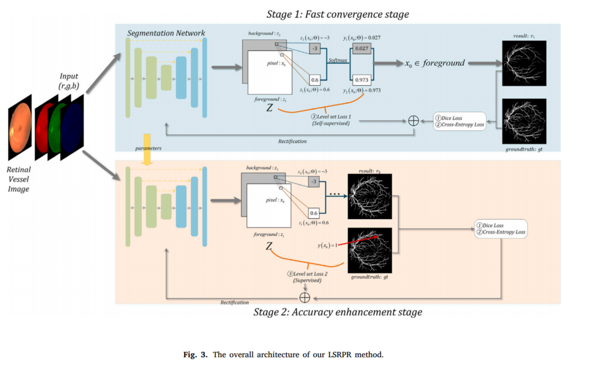
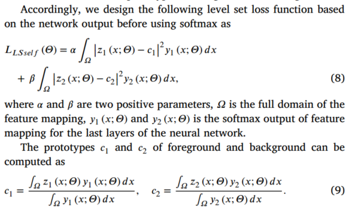
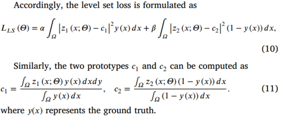
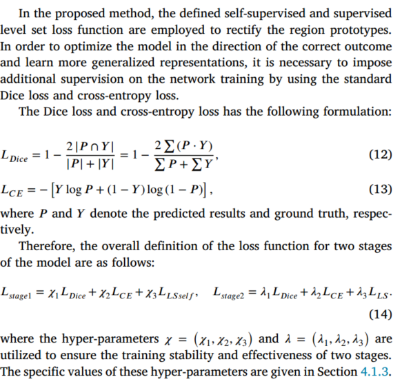

# Level set guided region prototype rectification network for retinal vessel segmentation（11）

GitHub源码：https：[//github.com/tweedlemoon/LSRPR](//github.com/tweedlemoon/LSRPR "//github.com/tweedlemoon/LSRPR")

[1-s2.0-S1746809423008613-main.pdf](file/1-s2.0-S1746809423008613-main_Ir6OBbhqQh.pdf "1-s2.0-S1746809423008613-main.pdf")

👍重点

- [ ] 提出了一个**水平集引导区域原型整流（LSRPR）框架**和一种具有可学习和自引导机制的**新型水平集损失（LS-loss）**。
- [ ] LSRPR首先以U-Net版本译码器的最后一层特征为输入，通过辅助自监督水平集损失对区域原型进行整流，然后利用监督水平集损失对预训练模型进行微调。LS-loss有助于模型产生可靠的引导，并增强神经网络模型解码器之间边的连续性。
- [ ] 文章只在网络的末端使用了水平集方法，并且还没有充分的挖掘出水平集方法的潜力

文章指出了本文的工作：

- [ ] 提出了一种水平集引导的区域原型校正框架(LSRPR) ，以产生可靠的制导，增强神经网络模型解码器之间的边缘连续性。
- [ ] 设计了两阶段的学习流水线，第一阶段利用自我监督的水平损失学习来加快网络的训练，第二阶段利用水平损失监督式学习来微调网络的分割精度。
- [ ] 我们分别给出了自监督水平集损失和监督水平集损失的两个表达式。
- [ ] 提出的 LSRPR 在三个公共视网膜血管分割数据集上获得了最先进的性能。更一般地说，它可以很容易地扩展到其他框架，以提高边界的准确性。

🎈水平集法（LS——Level set method）

对前景和背景进行权重计算对比，产生差异。

$$
L_{CV}(\phi)=\lambda_1\int_{\Omega}(I(x)-c_1)^2H(\phi(x))dx+\lambda_2\int_{\Omega}(I(x)-c_2)^2(1-H(\phi(x)))dx+\mu\int_{\Omega}|\bigtriangledown H(\phi(x))|
$$

系数分别都是正超参，\phi是水平集函数，H是Heaviside函数

$$
c_1=\frac{\int_{\Omega}I(x)H(\phi(x))dx}{\int_{\Omega}H(\phi(x))dx}
$$

$$
c_2=\frac{\int_{\Omega}I(x)(1-H(\phi(x)))dx}{\int_{\Omega}(1-H(\phi(x)))dx}
$$

c1和c2是前景和背景的强度的均值。

使用梯度下降法，使得水平方向的能量函数，形状区域等信息整合到能量函数中，可以提高水平集的分割性能。

🎈CNN和水平集法的结合

为了将深度卷积网络与水平集方法相结合，定义了一个关于水平集的能量泛函为:

$$
L=\alpha [\int_{\Omega}|H(\phi(x))-c_1|^2H(\phi(x))dx]+\beta[\int_{\Omega}|H(\phi(x))-c_2|^2(1-H(\phi(x)))dx]
$$

其中𝛺为输入图像的像素空间，将CNN输出的显著性值线性移位为\[- 0.5,0.5]，并将其作为水平集。

常数𝑐1和𝑐2分别表示内部()和外部()的平均显著性值。保持相对于𝑐1和𝑐2的能量函数不变并最小化，这两个常数可以表示为：

$$
c_1=\frac{\int_{\Omega}H(\phi(x))H(\phi(x))dx}{\int_{\Omega}H(\phi(x))dx}
$$

$$
c_2=\frac{\int_{\Omega}(1-H(\phi(x))H(\phi(x)))dx}{\int_{\Omega}(1-H(\phi(x)))dx}
$$

指的是最后一层替换成了softmax，并且修改了一个损失函数L

I是原始图像，y1和y2是上一层的输出，𝛩为可学习网络参数

c1和c2分别是前景和背景的像素平均值。

🎈网络方法

LSRPR模型整体架构

蓝色背景的上方部分是快速收敛阶段，该阶段利用水平集导出的自监督损失来引导网络快速收敛。

同样，橙色背景下的部分是使用监督水平集损失对分割网络进行微调的精度增强阶段。

在这两个阶段，分别基于骨干网的输出特征映射构造**自监督和监督水平集损失函数**。

- [ ] 快速收敛阶段

具体而言，将原始视网膜血管图像输入骨干网络，并输出带有与分割任务相关的量化通道数的最后特征映射。对于视网膜血管的二值分割，将网络最后一个特征映射的通道设置为2，其中一个特征映射负责预测前景，另一个特征映射负责预测背景。

在不损失一般性的前提下，我们将其中一个特征映射命名为𝑧1 (s1)，另一个命名为𝑧2 (s1)。

对于映射𝑧1(x)和𝑧2(x)的特征，由于CNN的限制，它们都没有体现区域信息。

为了使网络学习具有更高的抽象概念(如区域原型)，我们使用**水平集方法**获得前景和背景的原型。

- [ ] 精度提高阶段

在这个阶段中，我们通过结合地面真值来定义一个监督水平集损失。

具体来说，在精度增强阶段，我们继续以监督的方式训练在快速收敛阶段得到的网络参数。

与快速收敛阶段不同，精度增强阶段采用地面真值计算水平集损失。

- [ ] 总损失函数

