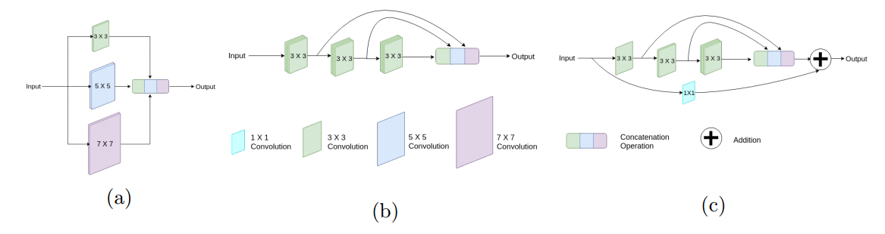
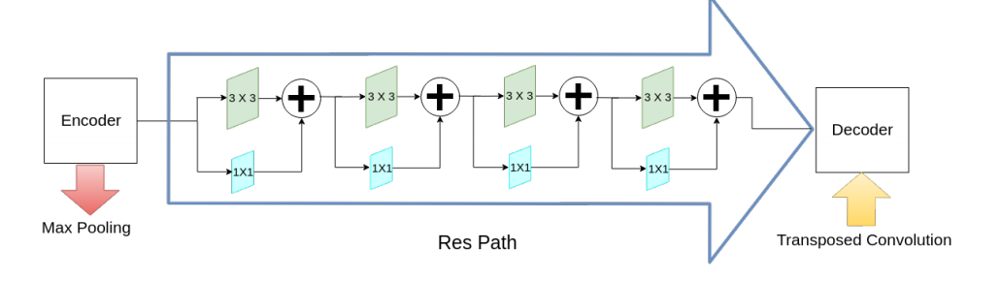

# MultiResUNet:对多模态生物医学图像分割U-Net架构的再思考（9）

[MultiResUNet.pdf](file/MultiResUNet_gLWiH44WFM.pdf "MultiResUNet.pdf")

👍重点

对于受噪声、扰动、缺乏清晰边界等影响的复杂图像，MultiResUNet的性能增益会显著提高

改进了编码器与解码器之间的桥梁，提出“MultiRes块”，图C

提出Res Path

另外本文使用W=a\*U，以此减少通道数量保持和U-Net的参数量一致。
