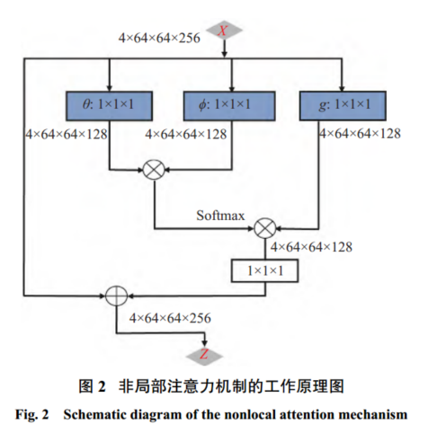
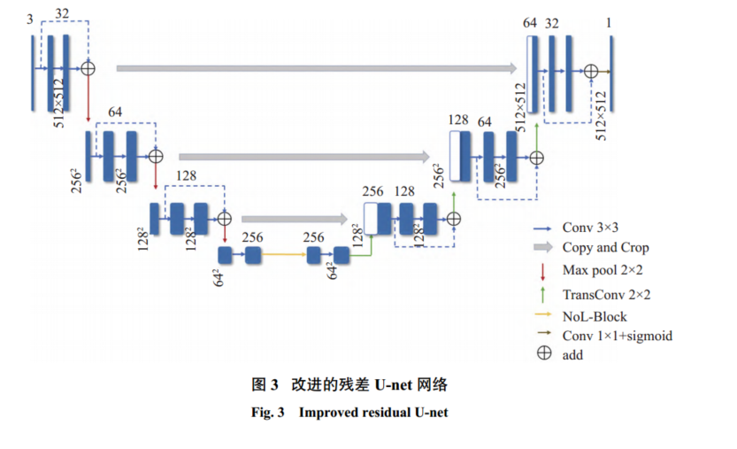

# Res-Unet改进（3）

[基于改进Res-UNet的视网膜图像血管分割\_杨涵.pdf](file/基于改进Res-UNet的视网膜图像血管分割_杨涵_7PX6dhQ_nz.pdf "基于改进Res-UNet的视网膜图像血管分割_杨涵.pdf")

🎈非局部注意力机制工作原理图

类似于利用VIT，输入图像转化成QKV进行，以及跳跃连接

🎈网络结构

在Unet中编码到解码区添加了NoL-Block
