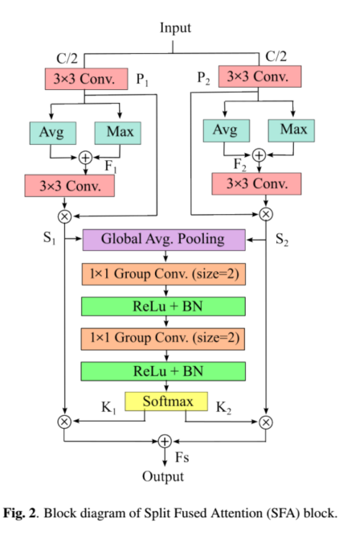
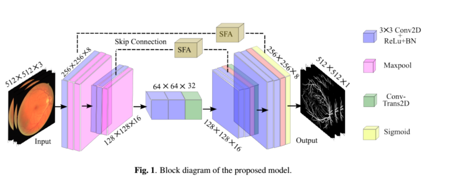
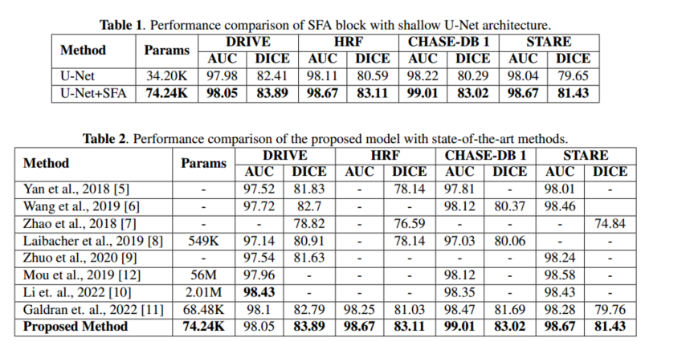

# 分裂-融合注意机制的浅U型网络（7）

[A\_Shallow\_U-Net\_with\_Split-Fused\_Attention\_Mechanism\_for\_Retinal\_Vessel\_Segmentation.pdf](file/A_Shallow_U-Net_with_Split-Fused_Attention_Mechani.pdf "A_Shallow_U-Net_with_Split-Fused_Attention_Mechanism_for_Retinal_Vessel_Segmentation.pdf")

文本贡献

提出了自注意力SFA模块（ Split Fused Attention）

融合了SFA和U-Net网络

SFA模块

SFA源于卷积块注意模块(CBAM)\[17]。

***

\[17] S. Woo, J. Park, J.-Y. Lee, and I. S. Kweon, “Cbam:Convolutional block attention module,” in Proceedingsof the European conference on computer vision (ECCV),2018, pp. 3–19.

***

结构图说明：首先将输入特征映射分割为C1和C2两半。这两部分分别通过初始的3 × 3卷积层，其输出称为P1和P2。两个输出都被并行地传递给空间平均和最大池，然后是逐像素的加法操作。因此，将得到的特征图F1和F2分别进行3 × 3卷积块处理，然后分别对P1和P2进行逐元素乘法运算，得到空间注意图S1和S2。在这里，**空间平均有助于粗略估计广阔区域的边界，而最大运算更侧重于血管区域**。因此，空间注意图使网络能够更多地关注血管分支和断点区域。在S1和S2上执行全局平均池化，以实现信道关注，减少信道冗余信息，使网络更加关注信息特征。接下来是2个连续的1 × 1分组卷积层，具有ReLu激活和批处理归一化。这里使用批归一化来避免模型训练过程中的过拟合。将通道注意得到的输出分成K1和K2两半，分别与S1和S2相乘，然后进行通道级联运算，得到最终的融合注意图Fs，如图2所示。

注：有一处说的很模糊，S1和S2进行全局平均池化，是分别进行的还是混合进行操作再分离，论文这里说的有点模糊，不过我个人觉得应该是分别进行的操作。

作用：SFA块的使用使网络能够专注于容易出现血管破裂点的区域，并学习这种情况下的分支模式和结构，以避免解码器部分的像素放置错误

网络模型

结果图

这里比较的Unet是减少了相应层的Unet——浅Unet
