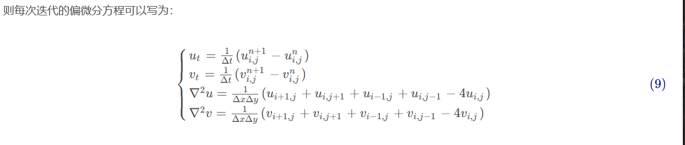
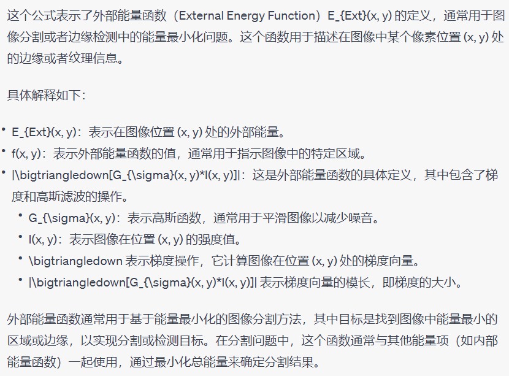
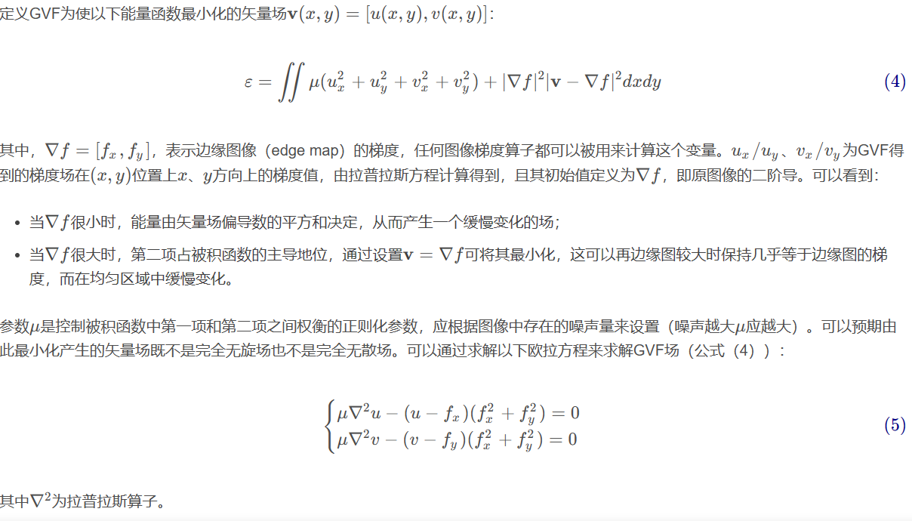
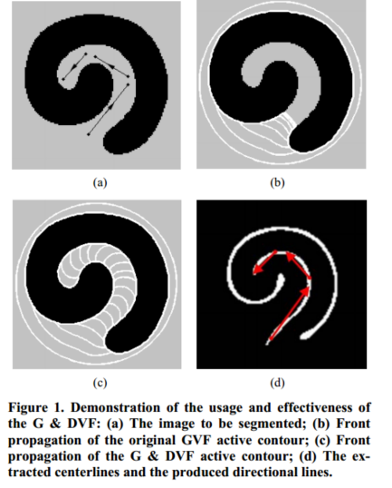
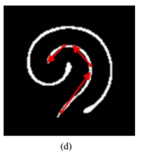
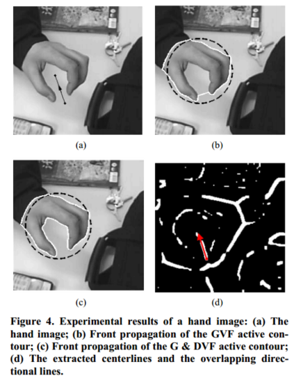

# 基于梯度和方向矢量流活动轮廓的图像分割中心线提取

[JSIP\_2013110617163804.pdf](file/JSIP_2013110617163804_iRDNfqIsU4.pdf "JSIP_2013110617163804.pdf")

参考[https://blog.csdn.net/cfan927/article/details/109114884](https://blog.csdn.net/cfan927/article/details/109114884 "https://blog.csdn.net/cfan927/article/details/109114884")

参考博客的第九个公式写的很好，

用近似值来代入，方便求解。

👍论文内容

自动提取中心线来引导用户提供正确方向信息的方法

一种新的外力称为梯度与方向矢量流(gradient & direction vector flow, G & DVF)\[12]，将**梯度与方向矢量流场与用户绘制的方向线产生的方向矢量场无缝结合**。这是一种非常简单的提供先验信息的方法，可用于任何图像。

在复杂目标形状的图像分割和处理弱边泄漏问题方面提供了很好的性能。

🎈公式演示

根本用法:

$$
F_{in}+F_{out}=0
$$

内部和外部的力达到平衡。

GVF

$$
E_{AC}(x)=\frac{1}{2}\int_{0}^1\alpha|x^{'}(s)|^2+\beta|x^{''}(s)|^2ds+\int_{0}^1E_{Ext}(x(s))ds
$$

第一部分是内部能量，第二部分是外部能量，分别用于正则化曲线x的平滑度和将曲线x吸引到物体边界。

\alpha和\beta分别是正超参数。

外部能量的定义：

$$
E_{Ext}(x,y)=-f(x,y)=-|\bigtriangledown[G_{\sigma}(x,y)*I(x,y)]|
$$

G \_{\sigma}(x,y)表示的是以sigma为标准差的高斯滤波器，

其中x和y分别是水平和垂直方向。

以下是GPT的解释（网络上对于GVF通俗解释的资料较少）：

定义GVF：

G\&DVF

半自动化方法，需要手动设置一个外力。

GVF的缺陷：在较为狭窄的隧道无法向前传播，会受到一个向外的力

G\&DVF为了解决这种情况，加入了一个根据先验知识处理的外力。

$$
E_{G-DVF}(V)=E_{GVF}(V)+\eta E_{DVF}(V)\qquad（***主要的引进公式）
$$

EGVF和EDVF分别表示由方向线生成的GVF函数和方向矢量流(direction vector flow, DVF)函数。

$$
E_{DVF}(V)=\int\int|w|^2|v-w|^2dxdy
$$

其中w为在图像中绘制方向线得到的DVF场。如图：

$$
w(x,y)=\begin{equation}
\left\{
\begin{aligned}
%\nonumber
\frac{b-a}{|b-a|},if\,(x,y)\,is\,on\,\bar {ab},\\
0,\qquad \qquad otherwise\\
\end{aligned}
\right.
\end{equation}

$$

b-a表示矢量的起点到终点。如果需要多条线就用方向矢量相加。

例子：

