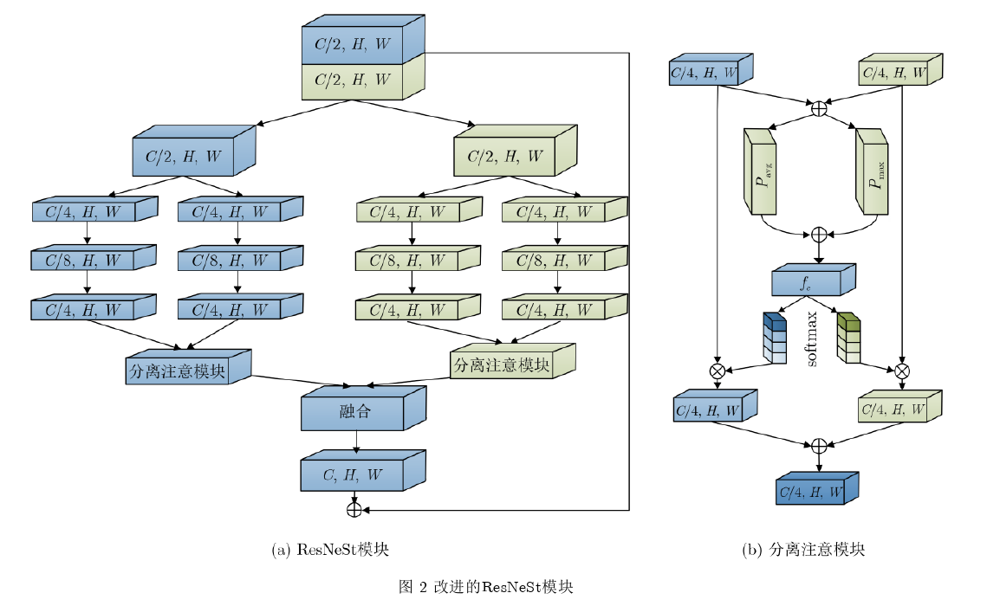
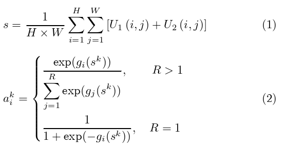
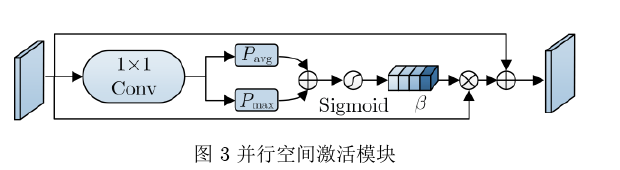
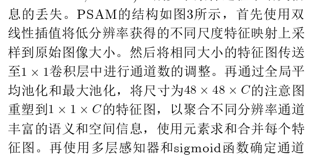
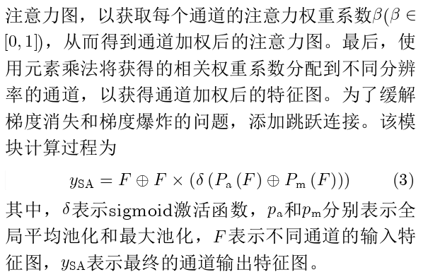
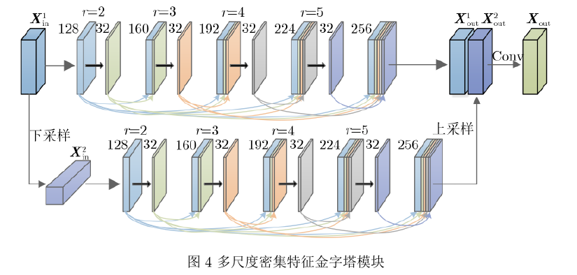
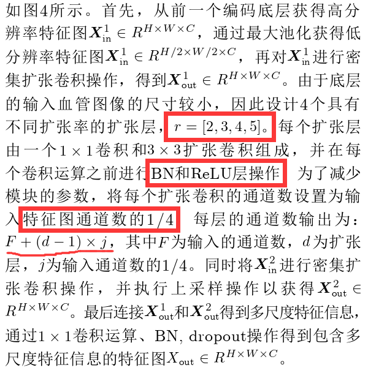
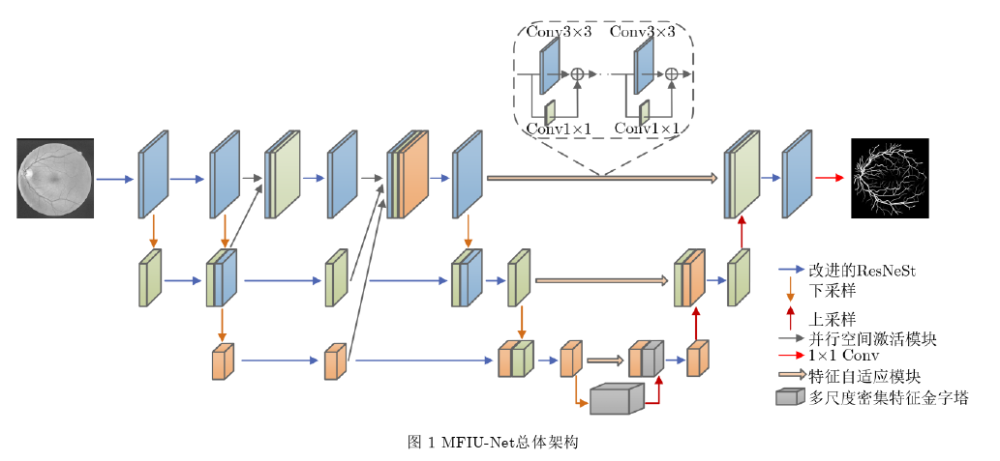
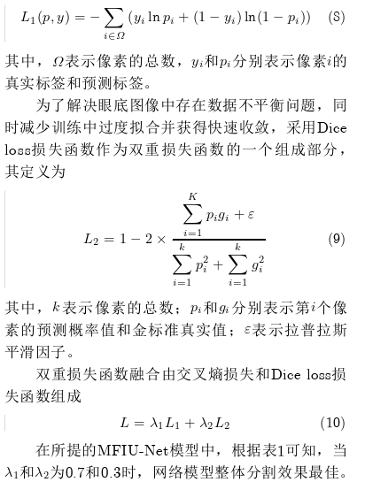
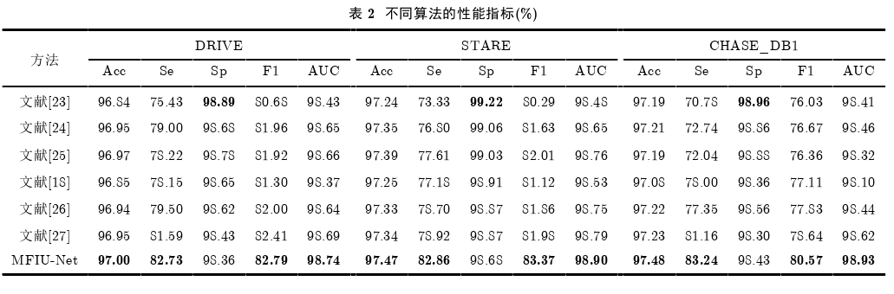

# 多分辨率融合输入的U型视网膜血管分割算法（8）

[多分辨率融合输入的U型视网膜血管分割算法\_梁礼明.pdf](file/多分辨率融合输入的U型视网膜血管分割算法_梁礼明_0dZv8xUYiM.pdf "多分辨率融合输入的U型视网膜血管分割算法_梁礼明.pdf")

2023/10/1

👍贡献

采用改进的ResNeSt代替传统卷积，优化血管分割边界特征；

将并行空间激活模块嵌入其中，捕获更多的语义和空间信息。

构架另一U型精细分割网络，提高模型的微观表示和识别能力。

一是底层采用多尺度密集特征金字塔模块提取血管的多尺度特征信息。

二是利用特征自适应模块增强粗、细网络之间的特征融合，抑制不相关的背景噪声。

三是设计面向细节的双重损失函数融合，以引导网络专注于学习特征。

😶‍🌫️改进ResNest

在每个基数块中应用分离注意模块，以整合来自两个分支的特征图，如图2(b)所示。首先通过元素求和将两个分支(表示为和)的特征映射进行融合，然后采用全局平均池化(gp)和全局最大池化(mp)生成通道统计信息，再将两个全连接(Fully Connected, FC)层和1个softmax层应用于S，以获得a1和a2，分别为U1和U2的通道注意权重。

其中，k表示分支数，gi映射表示通道拆分的权重。使用权重向量a1和a2，U1和U2的加权结果以及基块V的输出为：V1=a1*U1,V2=a2*U2,V=V1+V2 。接下来，两个基本块(表示为V1和V2)的输出通过沿通道维度的串联和一个1*1卷积(表示为F \_{1*1})进行融合：Z=F \_{1\*1}(V1,V2)。因此，最终输出Y为：Y=Z+T(X)，其中表示特征恒等映射。

😶‍🌫️并行空间激活模块（PSAM）

本文提出并行空间激活模块(Parallel Spatial Activa-tion Module, PSAM)，**减少下采样过程中语义信息的丢失**。

😶‍🌫️多尺度密集特征金字塔模块（MDFP）

Hu等人\[17]提出空洞空间卷积池化金字塔(Atrous SpatialPyramid Pooling, ASPP)使用不同的扩张卷积，以获取多尺度信息

\[17]HU Peijun, LI Xiang, TIAN Yu, et al. Automatic pancreassegmentation in CT images with distance-based saliency-aware DenseASPP network\[J]. IEEE Journal of Biomedicaland Health Informatics, 2021, 25(5): 1601–1611. doi: 10.1109/jbhi.2020.3023462

***

本文结合并联、级联和扩张卷积的优点提出多尺度密集特征金字塔模块(MultiscaleDense Feature Pyramid module, MDFP)，其结构如图4所示。

从图中还可以看出有稠密连接的操作。

😶‍🌫️特征自适应模块（FAM）

受文献\[11]的启发，本文引用特征自适应模块(Feature Adaptive Module, FAM)融合粗、精网络之间的特征分布。

\[11]IBTEHAZ N and RAHMAN M S. MultiResUNet:Rethinking the U-Net architecture for multimodalbiomedical image segmentation\[J]. Neural Networks, 2020,121: 74–87. doi: 10.1016/j.neunet.2019.08.025.

[MultiResUNet.pdf](file/MultiResUNet_D0g0W_VTFK.pdf "MultiResUNet.pdf")

***

为了恢复粗网络下采样阶段丢失的详细空间信息，采用卷积核大小为和的多层卷积减少粗、精网络之间的特征间隔，**FAM的结构如图1所示**。

在融合中部署了3个功能FAM，分别对应着32, 64和128通道。在多分辨率融合输入的第1层，由于特征映射具有高分辨率的特征，使用FAM的6个基本块来匹配特征分布。对应的第2层和第3层，特征映射具有较低分辨率的特征，分别使用FAM4个和2个基本块来调整双边网络之间的特征。

FAM是一个重量相对较轻、内存效率较高的模块，其参数数量相比AG模块和MSC模块较少。

MFIU-Net

👍双重损失函数

👌其他模型和本模型的对比

\[23]U-Net——ALOM Z, HASAN M, YAKOPCIC C, et al. Recurrent residual convolutional neural network based on U-Net (R2u-Net) for medical image segmentation\[EB/OL]. [https://arxiv.org/abs/1802.06955](https://arxiv.org/abs/1802.06955 "https://arxiv.org/abs/1802.06955"), 2018

\[24]U-Net++——ZHOU Zongwei, SIDDIQUEE M R, TAJBAKHSH N, et al.UNet++: Redesigning skip connections to exploit multiscalefeatures in image segmentation\[J]. IEEE Transactions onMedical Imaging, 2020, 39(6): 1856–1867. doi: 10.1109/tmi.2019.2959609.

\[25]HRNet——YU Changqian, XIAO Bin, GAO Changxin, et al. Lite-HRNet: A lightweight high-resolution network\[C]. The 2021IEEE/CVF Conference on Computer Vision and PatternRecognition, Nashville, USA, 2021: 10435–10445. doi: 10.1109/cvpr46437.2021.01030

\[15]AttU-Net——HU Jie, SHEN Li, and SUN Gang. Squeeze-and-excitationnetworks\[C]. The 2018 IEEE/CVF Conference on ComputerVision and Pattern Recognition, Salt Lake City, USA, 2018:7132–7141. doi: 10.1109/CVPR.2018.00745

\[26]Ladder-Net——ZHUANG Juntang. LadderNet: Multi-path networks basedon U-Net for medical image segmentation\[EB/OL]. [https://arxiv.org/abs/1810.07810](https://arxiv.org/abs/1810.07810 "https://arxiv.org/abs/1810.07810"), 2018.

\[27]BseResU-Net——LI Di and RAHARDJA S. BSEResU-Net: An attention-based before-activation residual U-Net for retinal vesselsegmentation\[J]. Computer Methods and Programs inBiomedicine, 2021, 205: 106070. doi: 10.1016/j.cmpb.2021.106070.

注：本文中很多文献都是用在结果的对比上面。

😋结束语

该模型的粗略分割网络以**多分辨融合**输入结构为主干，获取丰富的语义信息，生成高分辨率特征；

将设计的**PSAM**合并到优化的多分辨率主干中，以产生丰富的语义和位置信息。

另一精细分割网络，利用**U型结构**弥补粗略分割网络的空间信息丢失。

同时，网络底层增加设计的**MDFP**增大感受野，有效地提取图像的全局上下文特征信息。

增加改进的**ResNeSt**代替传统卷积运算，缓解分割结果边界模糊和细小血管不准确的问题。

最后，利用**FAM**对粗略和精细分割网络进行特征信息融合，降低分割图像中的噪声。

为网络设计注重细节的**双重损失函数**，专注于**细小血管部分多重优化学习过程**。
