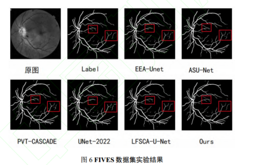
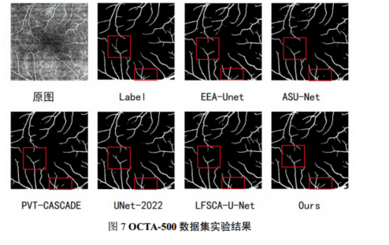
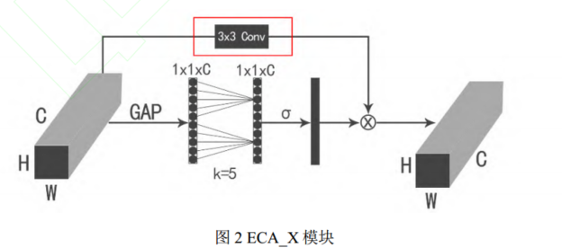
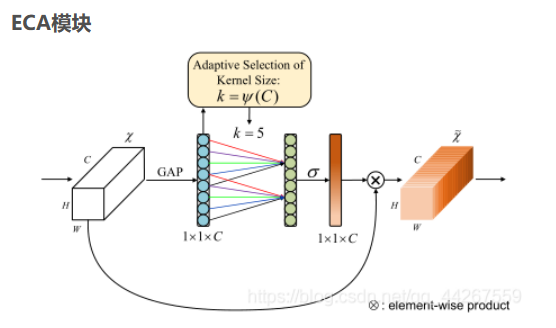
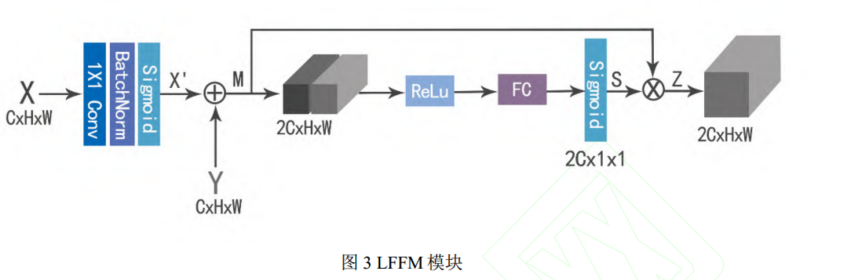
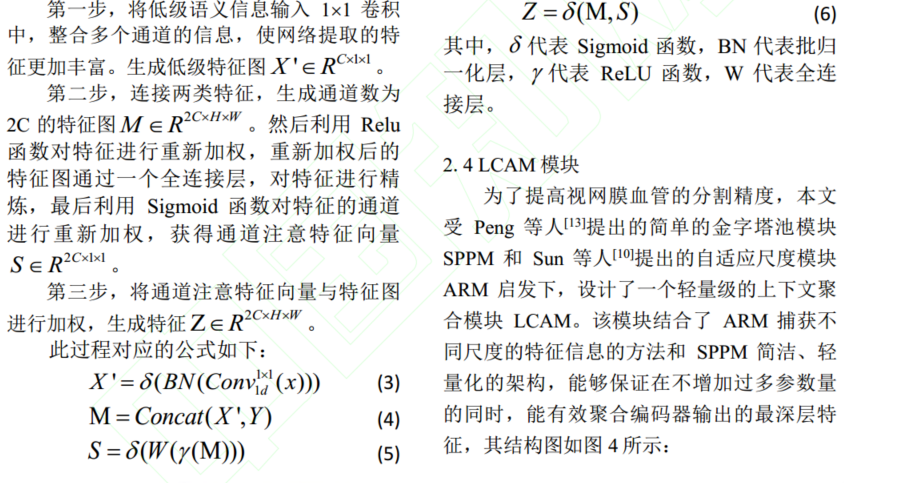
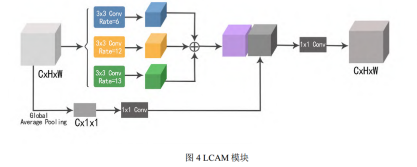
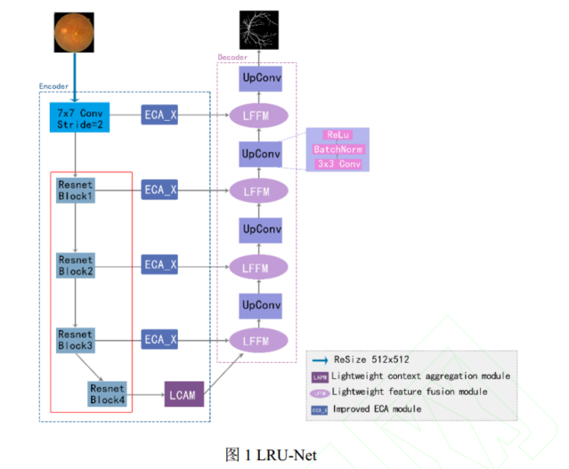

# 局部特征增强LRU-Net（4）

[基于局部特征增强的视网膜血管分割\_王倩.pdf](file/基于局部特征增强的视网膜血管分割_王倩_ta9Rf71ICa.pdf "基于局部特征增强的视网膜血管分割_王倩.pdf")

👍**目的：**

针对视网膜血管分割精度不高，经常出现分割断裂或者分割不到末端细小血管的问题，
提出了增强特征提取、特征融合以获得更多细小特征的方法

😭改进点

\*\*ECA 模块中加入 3×3 卷积，**增强对细节特征的提取。同时**提出了 LFFM 模块，**能有效融合浅层的低级特征和编码器中的高级特征，使得在上采样过程中能捕获更多的有用的特征信息。最后，** 针对编码器输出的最
深层特征设计了 LCAM 模块，\*\*该模块对高级语义特征能进行多尺度特征聚合，使得进入上采样的特征更加丰富，提高了特征表达能力。

😋未来工作

后续工作将**聚焦于如何利用现有技术能快速地且正确地分割血管**，无限接近专家标注结果，并且能够投入
到实际生活当中，辅助医生诊断治疗。

👌结果图

结论：从图 6 可以看到，在红框部分其他五个网络在分割血管末端时出现了不同程度的断裂和噪点，而 LRU-Net 不仅完整地分割到了末端血管且并未出现噪点，分割结果干净完整。从图 7 来看，红框部分其他五个网络对末端细小血管的特征提取并不到位，出现了不同程度的欠分割和不连续的情况，而 LRUNet 对于末端血管的分割更接近金标准且出现断裂和分割不到位的情况更少。此外，其他五个网络还出现了误分割现象，将背景误识别成了血管，整个分割结果断断续续且不完整。而 LRU-Net 的分割结果连续，出现断裂的情况较少，整个分割结果更接近金标准，说明本文的分割结果是优于其他五个网络的。

😐**网络部分**

采用U-net，编码器是ResNet34

🎈ECA\_X模块

在ECA模块的基础上增加了3\*3卷积，我们可以改成1\*3+3\*1卷积减少参数量。

GAP:全局平均池化

中间部分使用分组卷积

中间层卷积核大小k用以下公式给出，b和gamma是超参数

$$
k=|\frac{log_2C+b}{\gamma}|
$$

🎈LFFM模块

我们可以把FC层换成卷积层

***

根据UAFM模块启发

***

Concat连接。

🎈LCAM

设置三个空洞卷积

🎈LRU-Net

