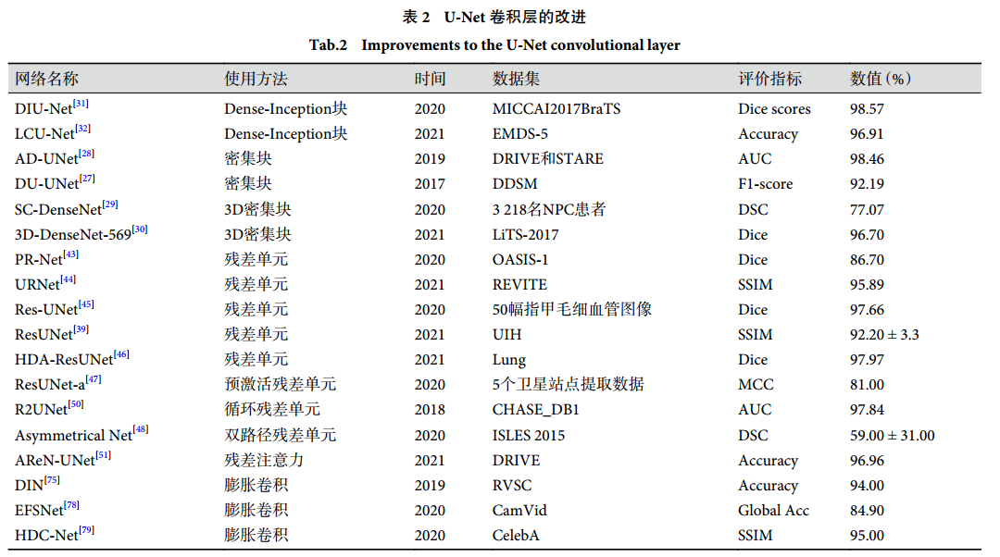

探析 U-Net 的改进机制及其在医学图像
分割的应用（提出了不同的思想）
===============

[swyxgcxzz-39-4-housenbao.pdf](file/swyxgcxzz-39-4-housenbao_v3miitW-oi.pdf "swyxgcxzz-39-4-housenbao.pdf")

主要讲解了Unet的各种改进措施

Unet卷积层的改进

Unet编解码的改进

Unet跳跃连接的改进

七大改进机制

七大改进机制包括：密集连接，残差连接，多尺度机制，集成机制，膨胀机制，注意力机制，Transformer机制。

🎈密集连接机制

代表：DenseUnet

卷积层的替换：

卷积层替换成密集块。密集快中的任意两层之间跳跃连接，即Dense

卷积替换成3D密集卷积块，有助于网络提取时空特征信息，从而提高网络参数的利用率。

卷积层替换成Dense-Inception模块，使网络更深更宽，减少梯度消失现象和冗余计算。

编解码加入密集连接

典型代表：

在编码器和解码器中引入密集连接融合来自较高层和较低层的多分辨率特征图，以加强当前层中的特征传播，从而改善编码器和解码器之间的信息流。

🎈残差连接机制

将 U-Net 的卷积层替换为残差块，跳跃连接使用残差连接路径与编、解码器用残差网络来替换。

典型代表：ResUnet

跳跃连接对于 ResUnet 来说是不可或缺的，它可以提高网络的表示能力，加快梯度反向传播，防止训练的不稳定性。

基于 U-Net 中残差连接机制的两个特点是：

① 残差结构会简化网络的训练；

② 残差单元中的跳跃连接以及 U-Net 网络的编码和解码之间的跳跃连接可以促进信息传播，避免梯度消失现象。

用于卷积层的改进

六种残差改进。

用于跳跃连接改进

作用：跳跃连接的改进是将残差机制应用在 U-Net 中的跳跃连接处，网络左、右侧分别表示 U-Net 中的编、解码器，中间为残差跳跃连接（residual path，Respath），可以提高 U-Net 网络的分割效果，减少参数量。

结构：在每一级中通过残差跳跃连接将每对相邻编码器和解码器分支进行连接，残差跳跃连接由两次卷积、BN、ReLU 与残差连接组成，可以捕获更复杂的特征并产生更高的精度。

用于编解码单元的改进

采用ResNet-34 模型作为 U-Net 架构的编码器部分，可以加快模型训练速度，提高鲁棒性。

🎈多尺度机制

所谓多尺度，实际上就是对图像的不同粒度的采样，在一种尺度下难以获取图像信息时在另外某种尺度下容易发现或者提取图像信息，在不同尺度下可以观察到不同的特征，从而完成不同的任务，所以多尺度技术常用于提取图像。

典型代表：MUnet

在U-Net 网络中多尺度机制有**两个特点**：

一是基于U-Net 使用多尺度输入，提升网络对不同尺度物体的识别能力；

二是通过在 U-Net 嵌入金字塔池化模块，提升网络对多尺度特征的提取和学习能力。

多尺度输入

在 U-N e t 中多尺度输入的方法主要有：AID、MDFA-Net、SLSNet、MED-Net。

网络将图像以不同尺度的图像大小输入到编码器之中，对其进行多尺度融合之后，提取中间层特征输入到解码器当中，MED-Net 实现了更高的量化指标。

金字塔池化模块

U-Net 中使用金字塔池化模块是一种充分利用全局信息的方式，捕获多尺度全局上下文信息并生成具有丰富表示的特征，这对于解决遮挡问题和提高分割性能至关重要。

主要思想是在网络编码器卷积之后反复利用金字塔池化模块融合多个空间尺度的全局上下文特征，有效地用作各种医学图像分割的工具。将金字塔池化生成的多条路径集成到编码阶段以保留语义信息和空间细节从而增强网络编码器的细节表示能力，具有更强的特征提取能力。

🎈集成机制

集成机制的特点是建立多个同质且存在差异的个体分类器来解决同一个问题，然后将所有个体分类器的预测结果通过策略组合得到集成机制的最终结果，目的是更好地提高模型的鲁棒性和泛化能力。

中间虚线框为 U-Net 模型 O，左上角虚线框为模型 A 的编码器结构，右下角虚线框为模型 B 的多尺度高中层语义信息融合结构图。

***

在 U-Net 中使用集成机制的主要有：2.5D Net、AssemblyNet、Ensemble U-Net、UNet-SCDC。

🎈膨胀机制（空洞卷积机制）

膨胀机制就是在 U-Net 的编、解码器中使用膨胀卷积，膨胀卷积是在标准卷积核中注入空洞，扩大的幅度称为扩张率，将小的卷积核尺寸变大同时保持卷积的参数量不变。

用于编解码

在编码器与解码器体系结构中引入了膨胀空间金字塔池化，以不同的膨胀速率提取更多的局部上下文信息，有助于恢复解码器部分的心脏器官边界，提高心脏边界的语义准确预测和详细分割。

用于瓶颈层

原始的卷积在很多情况都不能增大感受野，不能全面地捕获上下文信息，因此需要将瓶颈层中的卷积替换成膨胀卷积。主要方法有：HDC-Net、SD U-Net、MD-Unet。

🎈注意力机制

注意力机制\[82] 会对输入的上下文表示进行一次基于权重的筛选，通过这种加权的方式让 UNet 能学到空间上或者时序上的结构关系。

用于编解码器中

编、解码器使用注意力机制是在每次卷积或者反卷积之后使用注意力机制。

第一，在编码器中使用注意力机制是指将注意力机制加入 U-Net 的特征提取层，在编码阶段通过使用混合注意块来有效地增强图像特征并抑制斑点噪声。

第二，编解码器之间使用注意力机制是指在**下采样与上采样之间使用注意力机制和瓶颈层中使用注意力机制**，这样可以从编码的特征中选择更有用的特征，并将其发送到上层解码器。

第三，解码器中使用注意力机制是指在 UNet 解码器中加入的注意力模块，以自动突出相关的特征信息，同时抑制不必要的图像特征。

用于跳跃连接

🎈Transformer机制

堆叠了 6 层的编码器和解码器，是一种避免循环的模型结构。

编码器每个层结构包含两个子层：多头注意力层和前馈连接层。解码器有三个子层结构：遮掩多头注意力层、多头注意力层，前馈连接层，每个子层后面都加上残差连接和正则化层。

一种基于 U-Net 的Transformer ，此模型具有跳跃连接的多级Transformer，每个级别的转换器解码器接收三部分输入，**跳跃连接的残差嵌入、更高级别的转换器解码器的输出和查询嵌入**，使得更多信息特征得以重建，实现了更稳定的训练过程和更精确的异常检测和定位结果。

此外，随着注意力层被分解为多级，**模型计算成本和内存使用量**逐渐减少。

***

Chen Liyang, You Zhiyuan, Zhang Nian, et al. UTRAD: Anomaly detection and localization with U-Transformer. Neural Networks,2022, 147: 53-62.

[UTRAD: Anomaly detection and localization with U-Transformer](https://www.wolai.com/s5ymoAUTh1sBvJvnygFdq1 "UTRAD: Anomaly detection and localization with U-Transformer")
