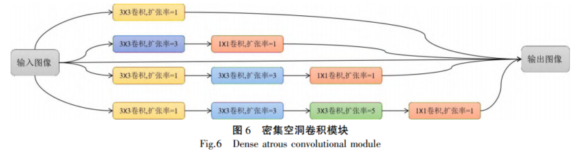
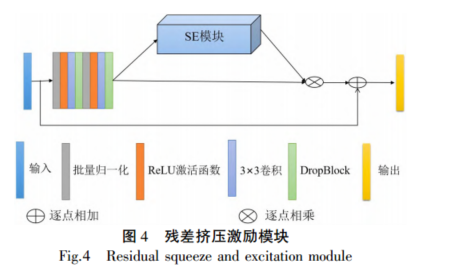
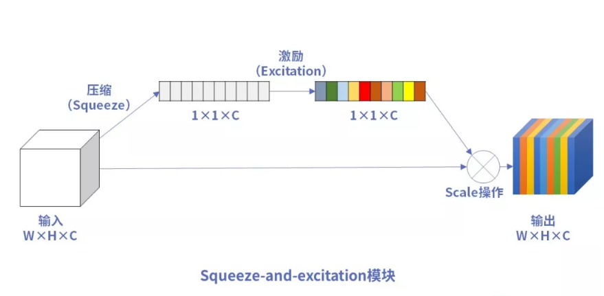
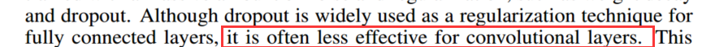
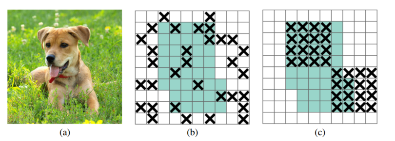
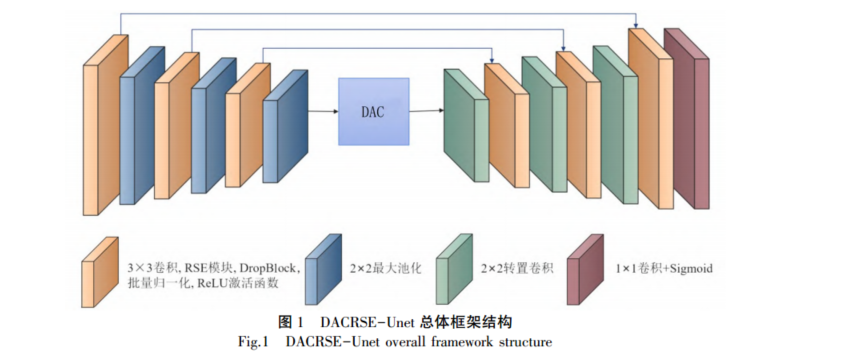
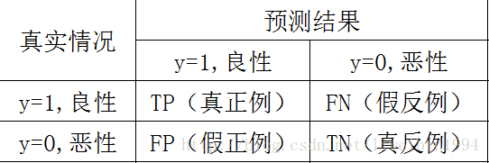
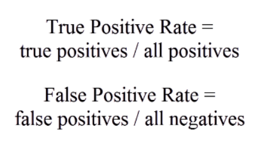

# 残差挤压激励与密集空洞卷积DACRSE-Unet（1）

[基于残差挤压激励与密集空洞卷积的视网膜血管分割\_徐艳.pdf](file/基于残差挤压激励与密集空洞卷积的视网膜血管分割_徐艳_3aY9ZgL203.pdf "基于残差挤压激励与密集空洞卷积的视网膜血管分割_徐艳.pdf")

**记录:**                                                                                                                                                      &#x20;

🎈DAC模块（密集空洞卷积）



❤️DAC复现

```纯文本
import torch
import torch.nn as nn


class DAC_Block(nn.Module):
    def __init__(self, in_channel, mid_channel, out_channel):
        super(DAC_Block, self).__init__()
        self.one = nn.Conv2d(in_channels=in_channel, out_channels=out_channel, kernel_size=3, dilation=1, padding=1)

        self.two = nn.Sequential(
            nn.Conv2d(in_channels=in_channel, out_channels=mid_channel, kernel_size=3, dilation=3, padding=3),
            nn.Conv2d(in_channels=mid_channel, out_channels=out_channel, kernel_size=1, dilation=1)
        )
        self.three = nn.Sequential(
            nn.Conv2d(in_channels=in_channel, out_channels=mid_channel, kernel_size=3, dilation=1, padding=1),
            nn.Conv2d(in_channels=mid_channel, out_channels=mid_channel, kernel_size=1, dilation=3),
            nn.Conv2d(in_channels=mid_channel, out_channels=out_channel, kernel_size=1, dilation=1),
        )
        self.four = nn.Sequential(
            nn.Conv2d(in_channels=in_channel, out_channels=mid_channel, kernel_size=3, dilation=1, padding=1),
            nn.Conv2d(in_channels=mid_channel, out_channels=mid_channel, kernel_size=3, dilation=3, padding=3),
            nn.Conv2d(in_channels=mid_channel, out_channels=mid_channel, kernel_size=3, dilation=5, padding=5),
            nn.Conv2d(in_channels=mid_channel, out_channels=out_channel, kernel_size=1, dilation=1),
        )

    def forward(self, x):
        x1 = self.one(x)
        # print(x1.shape)
        x2 = self.two(x)
        # print(x2.shape)
        x3 = self.three(x)
        # print(x3.shape)
        x4 = self.four(x)
        # print(x4.shape)
        x = x1 + x2 + x3 + x4
        return x


if __name__ == "__main__":
    img = torch.randn(1, 3, 512, 512)
    DAC_ = DAC_Block(3, 64, 128)
    img = DAC_(img)
    print(img.shape)

```

🎈RSE模块（残差激励模块）





上图RSE,下图SE。

❤️RSE复现

```纯文本
import torch
import torch.nn as nn
from DropBlock import DropBlock2d


class SE_Block(nn.Module):
    def __init__(self, ch_in, reduction=16):
        super(SE_Block, self).__init__()
        self.avg_pool = nn.AdaptiveAvgPool2d(1)  # 全局自适应池化
        self.fc = nn.Sequential(
            nn.Linear(ch_in, ch_in // reduction, bias=False),
            nn.ReLU(inplace=True),
            nn.Linear(ch_in // reduction, ch_in, bias=False),
            nn.Sigmoid()
        )

    def forward(self, x):
        b, c, _, _ = x.size()
        y = self.avg_pool(x).view(b, c)  # squeeze操作
        y = self.fc(y).view(b, c, 1, 1)  # FC获取通道注意力权重，是具有全局信息的
        return x * y.expand_as(x)  # 注意力作用每一个通道上


class Rse(nn.Module):
    def __init__(self, input_channels, output_channels):
        super(Rse, self).__init__()
        self.start = nn.Sequential(
            nn.BatchNorm2d(input_channels),
            nn.ReLU(),
            nn.Conv2d(in_channels=input_channels, out_channels=input_channels, kernel_size=3, stride=1, padding=1),
            DropBlock2d(p=0.5, block_size=3*3),
            nn.BatchNorm2d(input_channels),
            nn.ReLU(),
            nn.Conv2d(in_channels=input_channels, out_channels=input_channels, kernel_size=3, stride=1, padding=1),
            DropBlock2d(p=0.5, block_size=3*3),
        )
        self.se = SE_Block(input_channels)
        self.out=nn.Conv2d(input_channels,out_channels=output_channels,kernel_size=1)
    def forward(self, x):
        input = self.start(x)
        SE_ = self.se(input)
        SE_out = SE_ * input
        out = x + SE_out
        out=self.out(out)
        return out


if __name__ == "__main__":
    img = torch.randn(1, 3, 12, 12)
    RSE = Rse(3,64)
    img = RSE(img)
    print(img.shape)

```

🎈DropBlock（一种用于CNN正则化方法）

[DropBlock.pdf](file/DropBlock_UmnnQJ5F-F.pdf "DropBlock.pdf")

[DropBlock的原理和实现 - 知乎 (zhihu.com)](https://zhuanlan.zhihu.com/p/469849057 "DropBlock的原理和实现 - 知乎 (zhihu.com)")

[DropBlock - 知乎 (zhihu.com)](https://zhuanlan.zhihu.com/p/142299442 "DropBlock - 知乎 (zhihu.com)")

设计原因：DropOut在全连接层广泛使用，但是在卷积层很少使用，设计一个适用于卷积层的“Dropout”。





图中可以明显感受到，随机删除不能很好的去除掉信息，而删除连续区域就可以去掉这一部分的信息。

DropOut只是屏蔽掉一部分信息，而DropBlock是随机屏蔽一部分连续区域的信息

DropBlock和CutOut有点类似，只不过CutOut是用于图像的一种数据增强方法，而DropBlock是用在CNN的特征上的一种正则化手段。

原理：

$$
\gamma=\frac{(1-keepprob)*featsize^2}{blocksize^2*(featsize-blocksize+1)^2}
$$

block\_size是要删除的块的大小，γ控制要删除多少个激活单元

当block\_size=1时，DropBlock类似于dropout，当block\_size覆盖整个feature map时，DropBlock类似于SpatialDropout。

***

```纯文本
import torch
import torch.nn as nn
from torch.nn import functional as F


class DropBlock2d(nn.Module):
    def __init__(self, p, block_size, inplace=False):
        super().__init__()

        if p < 0.0 or p > 1.0:
            raise ValueError("p的范围是0-1")
        self.p = p
        self.block_size = block_size
        self.inplace = inplace

    def forward(self, input):
        if not self.training:
            return input

        N, C, H, W = input.size()
        gamma = (self.p * H * W) / ((self.block_size ** 2) * ((H - self.block_size + 1) * (W - self.block_size + 1)))
        mask_shape = (N, C, H - self.block_size + 1, W - self.block_size + 1)
        mask=torch.full(mask_shape, gamma)
        mask = torch.bernoulli(mask)#伯努利分布0-1
        mask = F.pad(mask, [self.block_size // 2] * 4, value=0)
        mask = F.max_pool2d(mask, stride=(1, 1), kernel_size=(self.block_size, self.block_size),
                            padding=self.block_size // 2)

        mask = 1 - mask
        normalize_scale = mask.numel() / (1e-6 + mask.sum())
        if self.inplace:
            input.mul_(mask * normalize_scale)#使mask的数变成0或者1
        else:
            input = input * mask * normalize_scale
        return input


if __name__ == "__main__":
    Drop = DropBlock2d(0.5, 3 * 3)
    img = torch.randn(1, 3, 12, 12)
    img = Drop(img)
    print(img.shape)

```

***

🎈DACRSE-Unet模型



模型总体框架结构如图 １ 所示。 由图 １ 可知，该模型保留了 **３ 层** Ｕ－Ｎｅｔ 的基本结构，为了防止出现梯度消失和网络退化等问题，并有效防止网络的过拟合、提高网络训练速度，设计了\*\* RSE模块代替原Ｕ－Ｎｅｔ中的卷积层\*\*，使用 ２×２ 最大池化层进行下采样操作。 为了捕获多尺度的血管特征信息，在编码器与解码器中间引入了 **ＤＡＣ 模块**来增大网络感受野，并充分提取上下文的有效信息。 通过 ２×２ 转置卷积进行上采样操作，将图像尺寸恢复到与输入图像一致，最后由解码层输出，传送至带有 Ｓｉｇｍｏｉｄ 激活函数的 １×１ 卷积，并输出最终预测的视网膜血管分割图像。

😋数据处理

由于 ＤＲＩＶＥ 和 ＳＴＡＲＥ 公开数据集上图片数据较少，为提高模型的泛化能力和鲁棒性，分别对这 ２ 个数据集进行如下数据增强处理：

１）对数据集随机旋转 ３６０ 度；

２）颜色变换；

３）添加高斯噪声；

４）水平和垂直翻转。

&#x20;上述每个处理都会把原始图像从 １ 幅扩增到 ４ 幅，将这 ２ 个数据集中的训练集分别都扩增到 ２３６ 幅图像，测试集分别为 ２０ 幅和 １０ 幅图像；其中，验证集采用**交叉验证**方法划分，占训练集的 １０％。 同时，对ＤＲＩＶＥ 和 ＳＴＡＲＥ 数据集的原始像素进行裁剪，**ＤＲＩＶＥ 数据集调整为 ５９２ 像素×５９２ 像素，ＳＴＡＲＥ 数据集调整为 ７０４ 像素×７０４ 像素**，**周围像素都使用 ０ 进行填充**

😢实验环境

实验在 ＣＰＵ 为 Ｉｎｔｅｒ（Ｒ） Ｃｏｒｅ（ ＴＭ） ｉ７－１２７００Ｆ、内存为 １６ ＧＢ、显卡为 ＮＶＩＤＡ Ｇｅｆｏｒｃｅ ＧＴＸ ３０６０ ＧＰＵ１２ ＧＢ的环境下进行，采用 \*\*Ｗｉｎｄｏｗｓ １０ \*\*操作系统

Batch\_Size=8 &#x20;

epochs=50

BCE交叉熵损失函数

Adam

lr=1e-4

🎈评价指标使用的是AUC

[模型评估指标AUC（area under the curve）\_模型评价指标英文-CSDN博客](https://blog.csdn.net/liweibin1994/article/details/79462554 "模型评估指标AUC（area under the curve）_模型评价指标英文-CSDN博客")

浅谈AUC：ROC曲线下的面积。

混淆矩阵：



ROC:二分类模型（0，1）中，设置一个阈值，大于阈值的输出1，小于阈值的输出0，所以在阈值从0→1变化的过程中，会出现很多对（FPR,TPR），将他们画在坐标系上就是ROC曲线了。



注意：ROC曲线不是光滑而是阶梯形，原因：样本的数量是有限的，而FPR和TPR的变化需要至少有一个样本变化了，在没有变化的间隙里，就不会有变化。也就是说，步进是1/样本数。

论文中AUC的数学表达公式如下：

$$
P_{Ace}=\frac{N_{TP}+N_{TN}}{N_{TN}+N_{TP}+N_{FN}+N_{FP}}（准确率）
 
$$

$$
P_{Se}=\frac{N_{TP}}{N_{TP}+N_{FP}}（敏感度）
$$

$$


P_{Sp}=\frac{N_{TN}}{N_{TN}+N_{FP}}（特异性）
$$

$$
P_{F1}=\frac{N_{2TP}}{N_{2TP}+N_{FN}+N_{FP}}(F1分数)
$$

说明：其中，F1分数为精确率与召回率之间的调和平均值，用于表征模型的分割结果与金标准（即医学专家手动分割结果）之间的相似程度，其值介于 ０～１ 之间；越接近 １，表明模型的分割效果越好。 ＲＯＣ 曲线是医学图像分割任务常用的评价指标，ＲＯＣ 曲线下面积 ＡＵＣ 的值越接近 １，说明模型的分割效果越好。

👌结论


🙌数据集方面                                                                                                                                        &#x20;

DRIVE：用于提取血管的数字视网膜图像数据集

20幅训练图像和20幅测试图像，每幅图像分辨率为565像素x584像素。

[DRIVE：用于提取血管的数字视网膜图像数据集\_帕依提提-人工智能数据集开放平台 (payititi.com)](https://www.payititi.com/opendatasets/show-26490.html "DRIVE：用于提取血管的数字视网膜图像数据集_帕依提提-人工智能数据集开放平台 (payititi.com)")

STARE:视网膜数据集

[STARE Dataset (kaggle.com)](https://www.kaggle.com/datasets/vidheeshnacode/stare-dataset "STARE Dataset (kaggle.com)")

20幅分辨率为700像素×605像素视网膜图像组成，由于在该数据集中官方未划分训练集和测试集，因此自动划分前 １０ 幅图像作为测试集，后 １０ 幅图像作为训练集。

❤️DACRSE-Unet复现

rt torch
import torch.nn as nn
from RSE import Rse
from DAC import DAC\_Block

class DACRse\_Unet(nn.Module):
def\_\_ init\_ *(self, in\_channel):
super(DACRse\_Unet, self).* *init* \_()
self.rse1 = Rse(input\_channels=in\_channel,output\_channels=64)
self.rse2 = Rse(input\_channels=64,output\_channels=128)
self.rse3 = Rse(input\_channels=128,output\_channels=256)
self.pool = nn.MaxPool2d(kernel\_size=2)
self.dac = DAC\_Block(256,mid\_channel=256,out\_channel=512)
self.Deconv\_3 = nn.ConvTranspose2d(in\_channels=512, out\_channels=256, kernel\_size=2,stride=2)
self.Deconv\_2 = nn.ConvTranspose2d(in\_channels=256, out\_channels=128, kernel\_size=2,stride=2)
self.Deconv\_1 = nn.ConvTranspo

```纯文本
import torch
import torch.nn as nn
from RSE import Rse
from DAC import DAC_Block


class DACRse_Unet(nn.Module):
    def __init__(self, in_channel):
        super(DACRse_Unet, self).__init__()
        self.rse1 = Rse(input_channels=in_channel,output_channels=64)
        self.rse2 = Rse(input_channels=64,output_channels=128)
        self.rse3 = Rse(input_channels=128,output_channels=256)
        self.pool = nn.MaxPool2d(kernel_size=2)
        self.dac = DAC_Block(256,mid_channel=256,out_channel=512)
        self.Deconv_3 = nn.ConvTranspose2d(in_channels=512, out_channels=256, kernel_size=2,stride=2)
        self.Deconv_2 = nn.ConvTranspose2d(in_channels=256, out_channels=128, kernel_size=2,stride=2)
        self.Deconv_1 = nn.ConvTranspose2d(in_channels=128, out_channels=64, kernel_size=2,stride=2)
        self.drse3=Rse(input_channels=256,output_channels=256)
        self.drse2=Rse(input_channels=128,output_channels=128)
        self.drse1=Rse(input_channels=64,output_channels=64)


        self.Last = nn.Sequential(
            nn.Conv2d(in_channels=64, out_channels=3, kernel_size=1),
            nn.Sigmoid()
        )

    def forward(self, x):
        x1 = self.rse1(x)
        # print(x1.shape)
        x1_pool = self.pool(x1)
        x2 = self.rse2(x1_pool)
        # print(x2.shape)
        x2_pool = self.pool(x2)
        # print(x2_pool.shape)
        x3 = self.rse3(x2_pool)
        # print(x3.shape)
        x3_pool = self.pool(x3)
        # print(x3_pool.shape)

        DAC_ = self.dac(x3_pool)
        # print(DAC_.shape)
        dx3 = self.Deconv_3(DAC_)
        # print(dx3.shape)
        rx3 = self.drse3(dx3)
        # print(rx3.shape)
        dx2 = self.Deconv_2(rx3)
        rx2 = self.drse2(dx2)
        dx1 = self.Deconv_1(rx2)
        rx1 = self.drse1(dx1)

        out = self.Last(rx1)
        return out


if __name__ == "__main__":
    img = torch.randn(1, 3, 256, 256)
    net = DACRse_Unet(3)
    img = net(img)
    print(img.shape)

```
