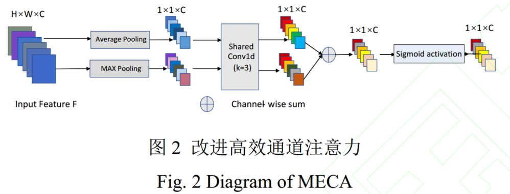
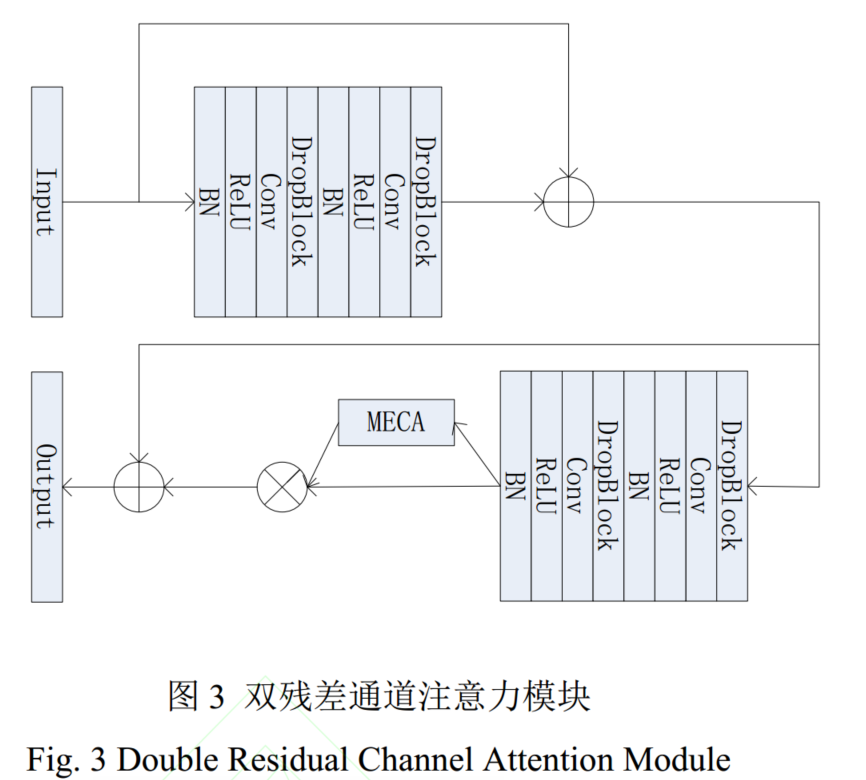
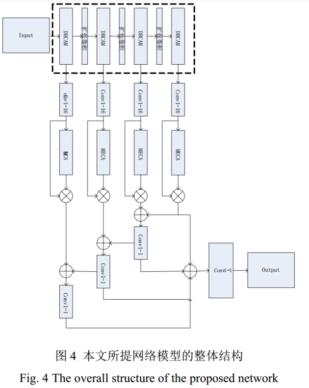
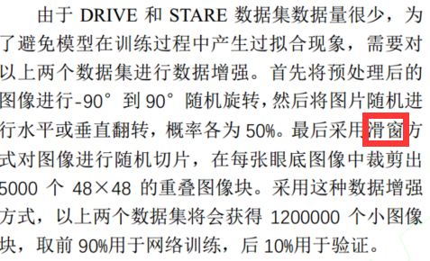

# 残差通道注意力（5）

[基于残差通道注意力的视网膜血管图像分割\_王文辉.pdf](file/基于残差通道注意力的视网膜血管图像分割_王文辉_Tm5_W5Mgd3.pdf "基于残差通道注意力的视网膜血管图像分割_王文辉.pdf")

👍提出结构

本文针对最近提出的高效通道注意力(ECA)模块进行了一些改进，提出了改进**高效通道注意力模块（MECA）**，这样可以使神经网络有效地提取更精细的血管结构。然后**加深了 HED网络结构**，提出了**双残差结构**，并用**结构化丢弃模块替换了原始的随机丢弃模块,把 MECA 嵌入残差结构**中，进一步加强了模型识别精细血管的能力。最后，在 **HED 网络结构的特征融合阶段加入短连接结构，并把 MECA 模块融入到短连接结构**中来进一步增强模型的灵敏度。

😐网络结构

🎈MECA

MECA 模块通过自动学习来学习每个特征通道的权重，并使用获得的权重来增强本文需要的血管特征和抑制对视网膜血管分割任务不重要的特征。换句话说，MECA 可以提取通道之间的通道统计，从而进一步增强网络的区分视网膜血管的能力。

🎈双残差注意力模块（DRCAM）

一开始我还以为是并行的两个残差网络，原来是顺序结构的两个残差网络。

🎈Net

图 4 显示了本文所提模型的详细结构，该模型是从传统\*\* HED 网络\*\*（看了下HED网络，其实图4中的网络和HED大部分都是不同的，只是借鉴了一部分的思路）改进而来。图中虚线框内为预训练部分，将原始的卷积块替换为 DRCAM 模块，并将**传统的池化层替换为扩张卷积层**，这么做的主要目的是为了在增加感受野的同时，保证特征图的输入尺寸不变方便后续进行特征融合。图 4 虚线框外的部分为侧输出部分，将经过预训练的特征图通过16 个 1×1 的卷积进行融合，然后通过一个 MECA模块，最后通过由高到低短连接结构，将具有不同级别的语义信息的特征图进行特征融合，这么做能够使模型充分利用不同级别的语义信息进行训练，减少低级语义信息中的噪声。

另外本文没有提出扩张卷积的扩张率，需要自行设定。

😭扩张卷积层

扩张卷积=膨胀卷积=空洞卷积

👍数据集处理

