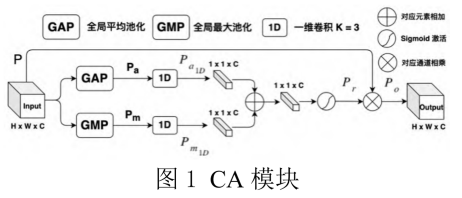
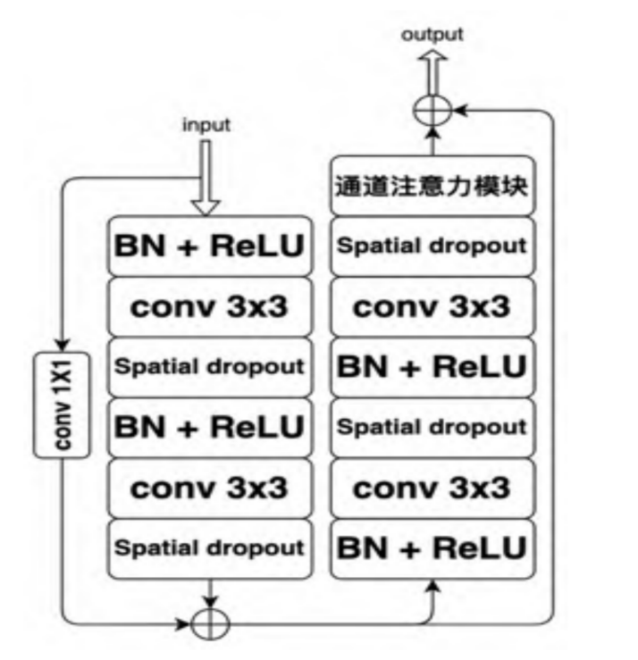
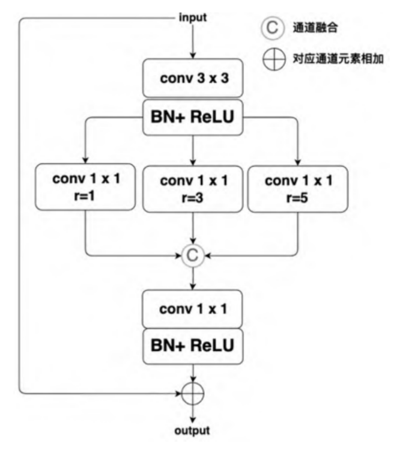
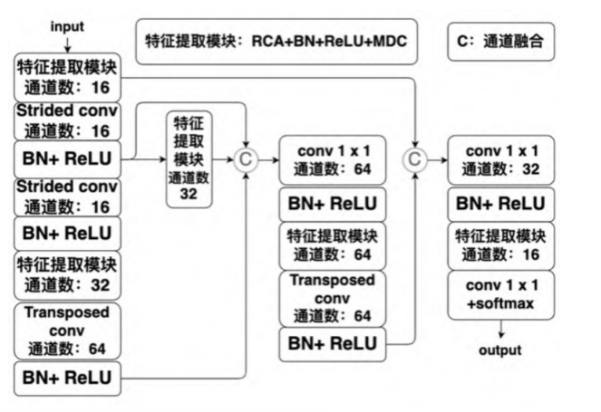

# 浅层非对称结构RCA+MDC（2）

[一种浅层非对称结构的视网膜血管分割网络\_王耀.pdf](file/一种浅层非对称结构的视网膜血管分割网络_王耀_H2tthWNWQD.pdf "一种浅层非对称结构的视网膜血管分割网络_王耀.pdf")

记录

🎈RCA模块

下图是RCA结构图。

🎈MDC模块

🎈Net

😢实验环境

云服务器，显卡为RTX 3090。

TensorFlow 2.5.0

Batch\_size=4

Adam

epoch=100   前75次lr=1e-3  后25次lr=1e-4

👍数据集

DRIVE

...

CHASE-DB1

[CHASE\_DB1 Dataset | Papers With Code](https://paperswithcode.com/dataset/chase-db1 "CHASE_DB1 Dataset | Papers With Code")

用于视网膜血管分割的数据集，包含28幅像素大小为999 × 960的彩色视网膜图像，分别采集自14名学龄儿童的左右眼。每张图片都由两位独立的人类专家进行注释。
