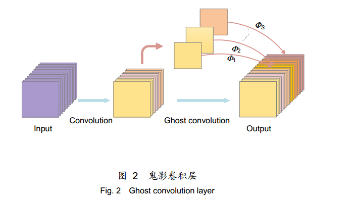
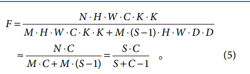
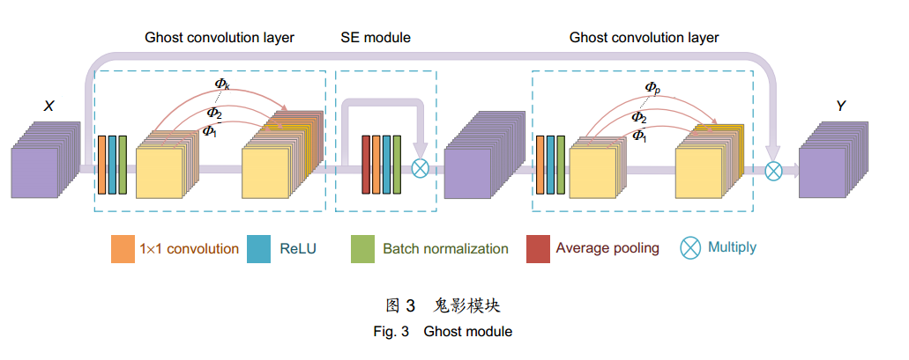
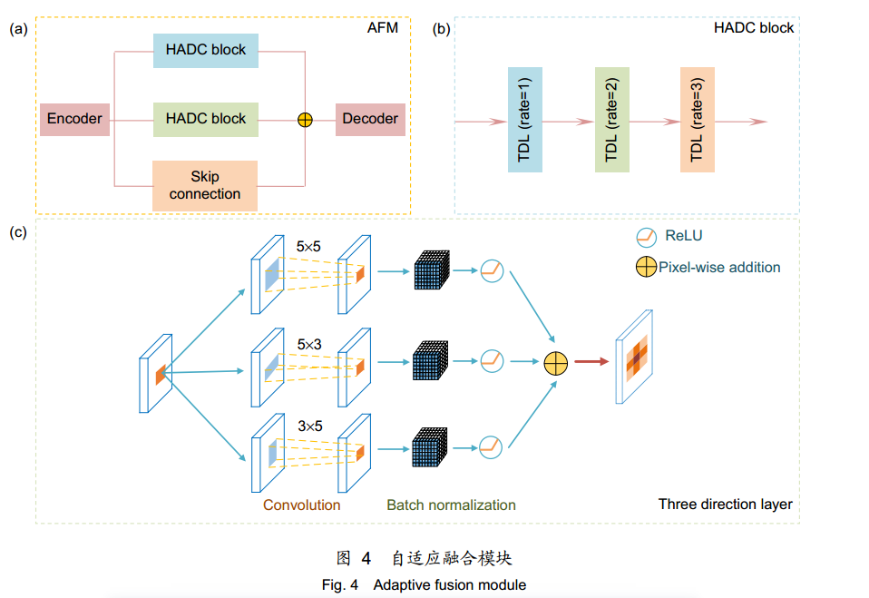
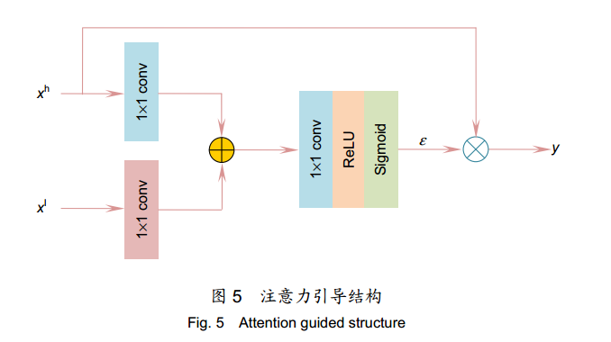
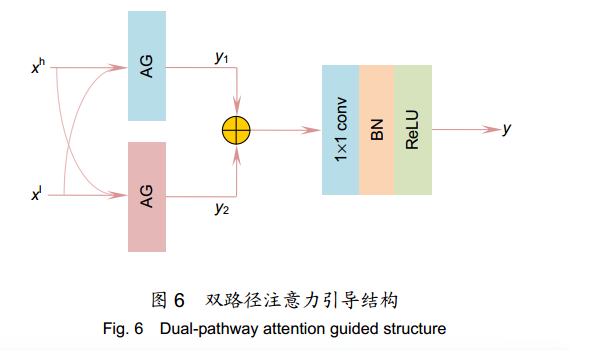
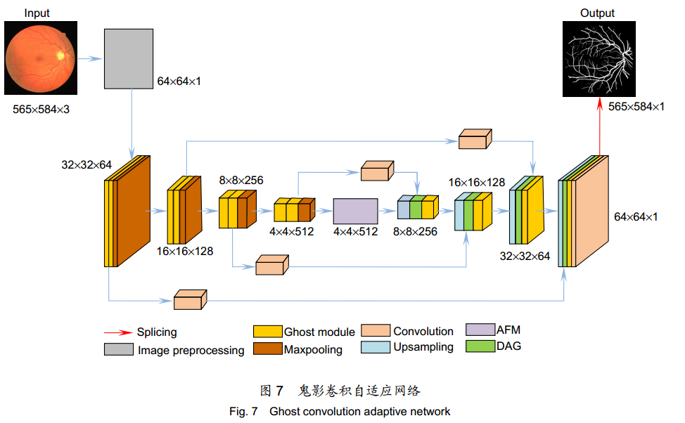
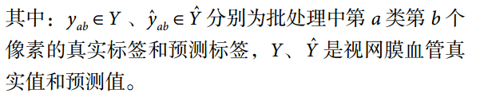
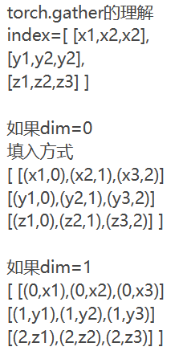

# 鬼影卷积自适应视网膜血管分割算法（10）

[gdgc-48-10-210291-1.pdf](file/gdgc-48-10-210291-1_T6nXCBpnFD.pdf "gdgc-48-10-210291-1.pdf")

👍重点

算法一是用**鬼影卷积**替代神经网络中普通卷积，鬼影卷积生成丰富的血管特征图，使目标特征提取充分进行。

二是将生成的特征图进行**自适应融合**并输入至解码层分类，自适应融合能够多尺度捕获图像信息和高质量保存细节。

三是在精确定位血管像素与解决图像纹理损失过程中，构建**双路径注意力**引导结构将网络底层特征图与高层特征图有效结合，提高血管分割准确率。

引入 **Cross-Dice Loss 函数**（一种新的损失函数）来抑制正负样本不均问题，减少因血管像素占比少而引起的分割误差，在DRIVE 与 STARE 数据集上进行实验，其准确率分别为 96.56%和 97.32%，敏感度分别为 84.52%和83.12%，特异性分别为 98.25%和 98.96%，具有较好的分割效果。

🙌结语

利用鬼影卷积快速生成丰富特征图的优势，充分提取血管特征。

编码层捕获信息经过自适应融合模块后输入解码层中分类，自适应模块利用**非对称卷积核交叉融合**血管像素，高质量保存视网膜血管细节。

为**弱化池化层噪声干扰**，采用**双路径注意力**引导结构级联低级特征图与高级特征图，让视网膜特征能够全局传递。

此外，本文引入**新型混合损失(Cross-Dice Loss)函数**来抑制正负样本不均问题，减少因前景占比少而引起的分割误差，得到优异分割结果。

实验结果表明，本文算法综合性能优于现有算法，其分割精度数值较高，对于眼科疾病诊断拥有一定应用价值。

缺点：虽然鬼影卷积能够生成丰富的特征图，但不能很好地确定每张图片信息度，无法辨别出高质量特图。

🎈鬼影模块

[GitHub - huawei-noah/Efficient-AI-Backbones: Efficient AI Backbones including GhostNet, TNT and MLP, developed by Huawei Noah's Ark Lab.](https://github.com/huawei-noah/Efficient-AI-Backbones "GitHub - huawei-noah/Efficient-AI-Backbones: Efficient AI Backbones including GhostNet, TNT and MLP, developed by Huawei Noah's Ark Lab.")

[GhostNet.pdf](file/GhostNet_7N_cxjIpwg.pdf "GhostNet.pdf")

鬼影卷积如上

***

🎈自适应特征融合（一般就用空洞卷积）

本文基于非对称扩张卷积提出自适应融合模块(adaptive fusion module，AFM)，该模块由一对混合非对称扩张卷积(HADC)\[8]和一个跳跃路径(skip connection)\[9]组成。自适应融合主要思想是通过不同感受野分支捕获不同尺度信息，从而达到多维特征提取，整体结构如图 4(a)所示。

\[8]Zheng X W, Huan L X, Xia G S, et al. Parsing very high resolution urban scene images by learning deep ConvNets with edge-aware loss\[J]. ISPRS J Photogrammetry Remote Sens, 2020, 170: 15–28.&#x20;

\[9]Zhang S D, He F Z. DRCDN: learning deep residual convolutional dehazing networks\[J]. Vis Comput, 2020, 36(9): 1797–1808.&#x20;

***

TDL 利用 5×5 空洞卷积探索全局信息，3×5 空洞卷积补充横向层信息，5×3 空洞卷积补充纵向层信息，多方向元素交叉融合可以保存高质量细节。

支路的跳跃连接由 1×1 卷积构成，用于防止梯度爆炸和梯度消失(导数出现指数上升和下降)。

🎈注意力机制

原因：U-Net原始上下采样方式容易丢失底层特征，难以高精度预测出视网膜血管轮廓。

目的：增强眼底血管像素

***

单注意力：

注意力引导(AG)结构通过跳跃式连接将低级特征图(编码层特征图)与高级特征图(解码层特征图)级联，增强眼底像素传递，改善血管细节模糊现象，结构如图 5 所示。

xh是高级特征图，xl是低级特征图，低级和高级特征图先用 1×1卷积处理并相加，在用 1×1 卷积提取血管特征，ReLU激活函数防止梯度消失，Sigmoid 函数获取注意力系数ε∈\[0,1]，注意力系数与高级特征图 xh相乘确定其权重，与目标任务关系越紧密的图像被保留的特征越多。

***

双注意力：

原因:单路径注意力引导结构可能会导致空间图像产生噪声，影响模型分割的鲁棒性。

改进：本文将单路径引导结构改进成双路径引导 (dual-pathway attention guided，DAG)结构，结构如图 6 所示。

🎈网络结构

每一个低级和高级图像特征的连接层都采用DAG

👍新型损失函数（缝合CE和DICE）

视网膜血管分割任务中常用交叉熵损失(Cross -entropy Loss)函数衡量模型预测的好坏，Cross-entropy Loss 基于像素平均值预测，面对血管像素占眼底图像整体像素比例较小时，会使预测偏向背景目标。

CE：

$$
\sigma(x_i)=\frac{e^{x_i}}{\sum_{k=1}^ne^{x_k}}
$$

$$
L=-\sum_{i=0}^n{y_iln{\sigma({x_i})}}
$$

y是标签,\sigma(x\_i)是预测值

Dice-coefficient Loss （DICE损失）可以引入权重来缓解类别间不平衡的影响，关注预测与事实之间重叠，但分割眼底图像边界时效果较差。

DICE：

$$
Dice-coefficient=\frac{2|X∩Y|}{|X|+|Y|}
$$

$$
DiceLoss=1-{Dice-coefficient}
$$

将\*\* Dice-coefficient Loss 和Cross-entropy Loss \*\*混合成一种新型损失(Cross-Dice Loss)函数用于本文算法评估，可以很好地适应前景与背景像素比例不平衡的分割任务，表现出预测结果与实际结果的区别，新损失函数定义为

$$
Loss=-\frac{1}{B}\sum_{a=1}^A\sum_{b=1}^B(y_{ab}log\hat{y}_{ab}+\frac{2y_{ab}*\hat{y}_{ab}}{y^2_{ab}*\hat{y}^2_{ab}})
$$

[https://zhuanlan.zhihu.com/p/369683910](https://zhuanlan.zhihu.com/p/369683910 "https://zhuanlan.zhihu.com/p/369683910")

[图解PyTorch中的torch.gather函数 - 知乎 (zhihu.com)](https://zhuanlan.zhihu.com/p/352877584 "图解PyTorch中的torch.gather函数 - 知乎 (zhihu.com)")

